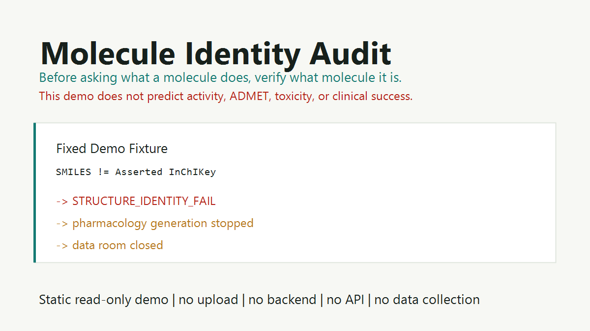

# Molecule Identity Audit

Molecule Identity Audit is a fail-closed molecular identity and metadata consistency audit framework.

It does not predict activity, ADMET, toxicity, clinical success, drug-likeness, or investment value.

Before asking what a molecule does, verify what molecule it is.

## Public Demo

Live static demo:

https://funny-baklava-d89a88.netlify.app/



The demo is intentionally static and read-only:

- no upload
- no backend
- no API
- no analytics
- no cookies
- no data collection
- no arbitrary molecule input

## What This Is

This is a public-facing methodology and demo repository for molecular identity and evidence-boundary validation.

It illustrates how a molecule record can be stopped before downstream claims when identity metadata fails consistency checks.

Example public demo chain:

```text
SMILES != asserted InChIKey
-> STRUCTURE_IDENTITY_FAIL
-> pharmacology generation stopped
-> data room closed
```

## What This Is Not

This is not an AI drug discovery platform.

This repository does not provide:

- pharmacology prediction
- ADMET prediction
- toxicity prediction
- docking
- target-fit scoring
- Ki / IC50 prediction
- clinical prediction
- molecule recommendation
- investment advice
- a production SaaS backend

## Current Public Scope

This public repository is a showcase layer. It contains:

- static Netlify-ready demo page
- public methodology notes
- Basic Structure Audit template
- claim-boundary rules
- roadmap through P1.2
- small public fixture language

Non-public implementation details and service workflows are intentionally not included in this public showcase.

## Validation Principles

The framework follows conservative audit behavior:

- A parseable structure is not automatically an identified molecule.
- A database no-match is not proof that a molecule is fake.
- A salt, fragment, or multicomponent structure must not be silently normalized away.
- Incomplete stereochemistry is not the same as parse failure.
- A downstream PASS must be earned, not inferred.
- When evidence boundaries are unclear, the workflow should stop rather than fabricate confidence.

## Documentation

- [Basic Structure Audit Template](docs/BASIC_STRUCTURE_AUDIT_TEMPLATE.md)
- [Claim Boundary](docs/CLAIM_BOUNDARY.md)
- [Roadmap](docs/ROADMAP.md)
- [P1.2 Status Note](docs/P1_2_STATUS_NOTE.md)

## Repository Layout

```text
.
├── README.md
├── assets/
│   └── screenshot.png
├── docs/
│   ├── BASIC_STRUCTURE_AUDIT_TEMPLATE.md
│   ├── CLAIM_BOUNDARY.md
│   ├── P1_2_STATUS_NOTE.md
│   └── ROADMAP.md
└── site/
    ├── index.html
    └── README.txt
```

## Local Preview

Open `site/index.html` in a browser. No build step is required.

For Netlify Drop, deploy the `site/` folder.

## Public Boundary

The purpose of this public repository is to establish credibility, method discipline, and reviewable boundaries without publishing the full commercial validation system.

Public:

- README
- architecture and method overview
- static demo
- Basic Structure Audit example
- known non-goals
- limited roadmap

Not included here:

- private validation assets
- production service workflows
- resolver implementation details
- customer-specific delivery processes
